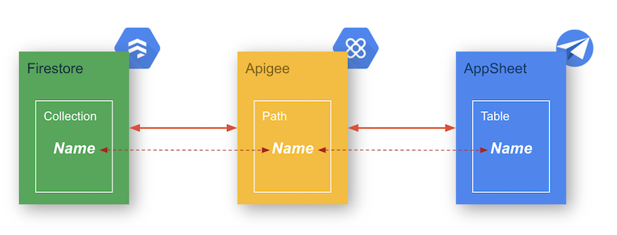
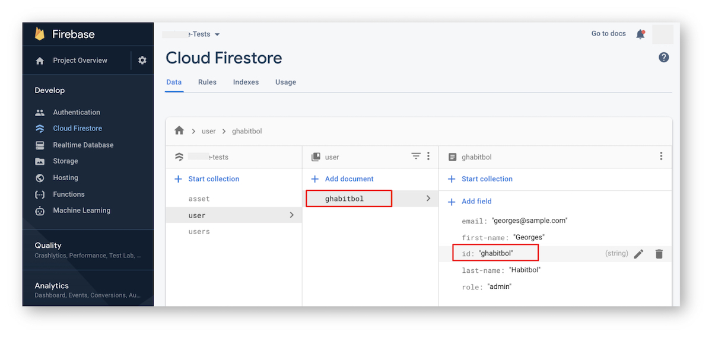
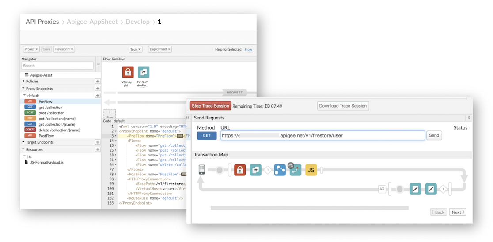

 

#  Apigee: Firestore Proxy for AppSheet

CRUD Apigee proxy to be used by AppSheet to use Firestore as Data Source.

- One single API Proxy can provides access to Firestore collections of one GCP Project.
- Open APi Specification Path dynamically defines the name of the Firestore collection as well as the name of the table in AppSheet Application

As easy as 1_2_3_4...

## 1- Firestore

https://console.firebase.google.com/
- [Create Collection](https://firebase.google.com/docs/firestore/quickstart)

> NOTE:  
> Currently, the document ID used to create a new document (mandatory) is a field named **ID** : don't forget it in data structure/json payload).

## 2- Google Cloud

https://console.cloud.google.com
- [Create Service Account for Firestore](https://firebase.google.com/docs/admin/setup#add_firebase_to_your_app)

## 3- Apigee 

https://apigee.com
- Configure [Firestore extension](https://docs.apigee.com/api-platform/reference/extensions/google-cloud-firestore/google-cloud-firestore-extension-120)
- Deploy Apigee proxy
- Create/upload specification
- Create API Product / Developer App. (copy API Key)

## 4- AppSheet 

https://www.appsheet.com/
- Create [Apigee Data Source](https://www.appsheet.com/Account/Account/Sources)
    - You can use swagger samples from this repo (asset, user)
    - Use the API key copied just before
- Create Application
- Enjoy !

